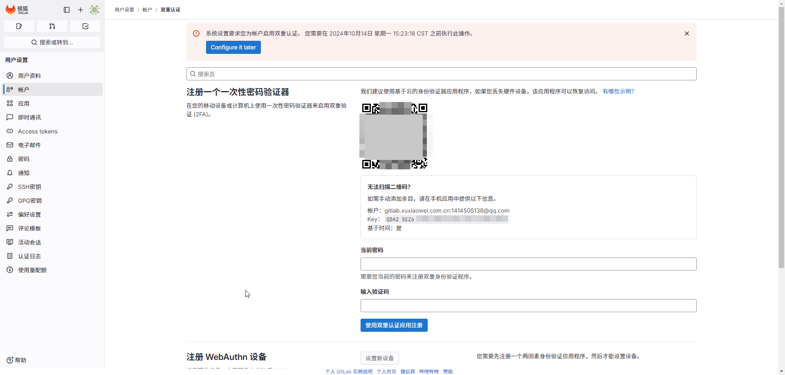
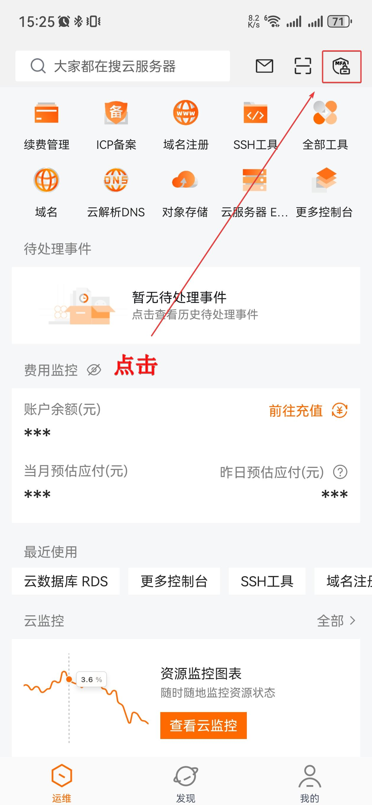
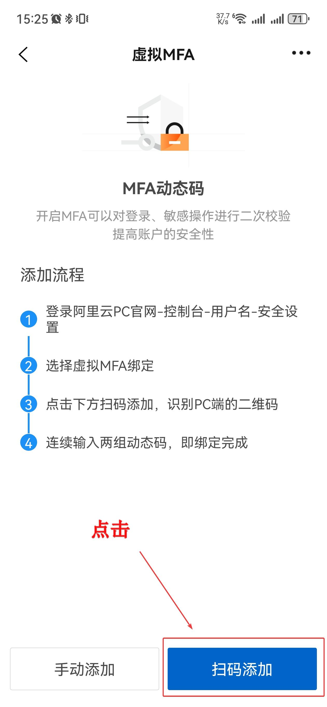
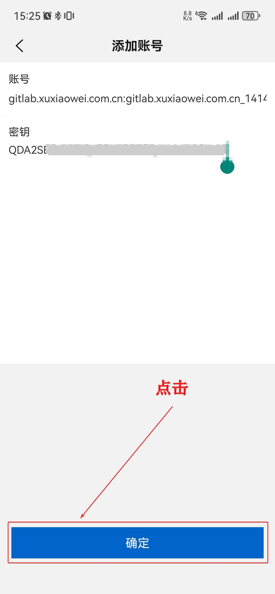
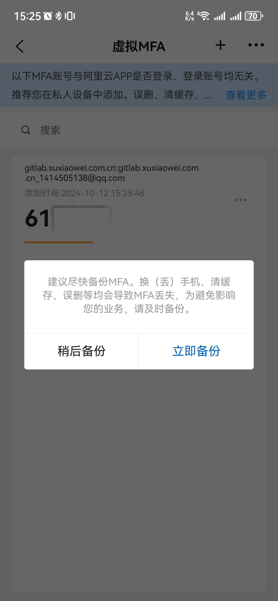
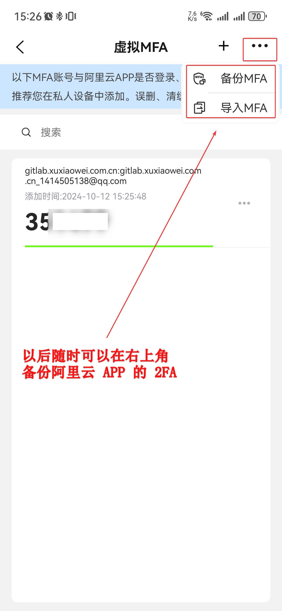
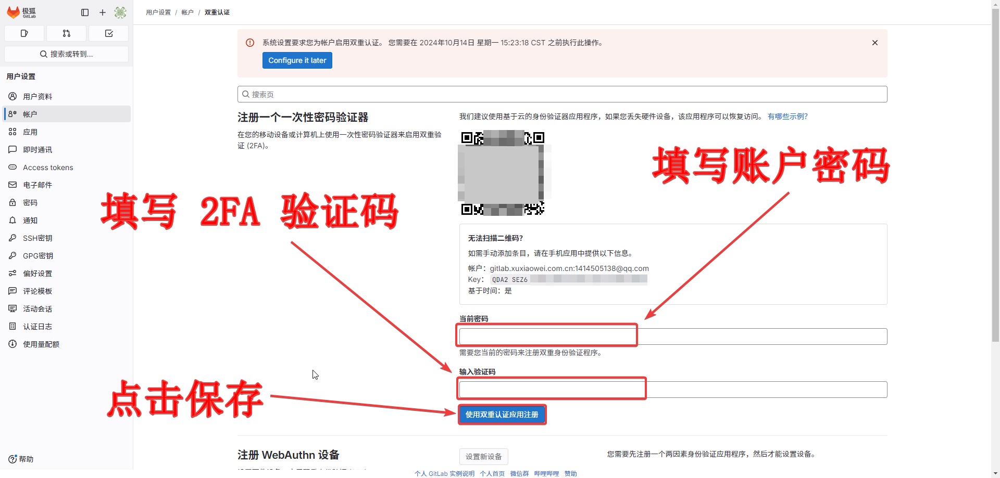
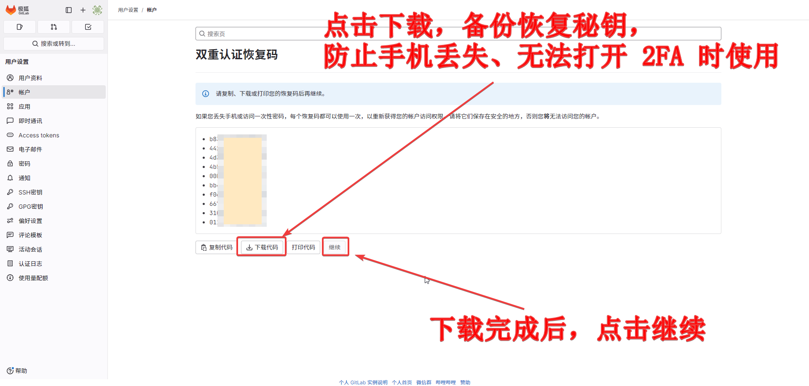
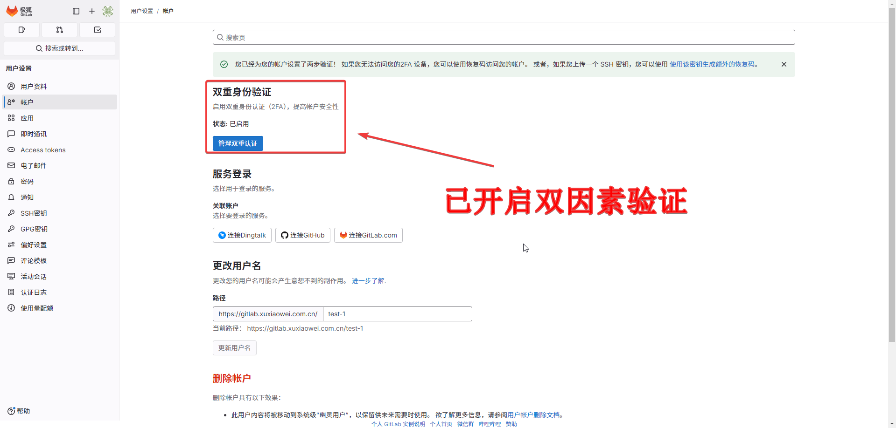
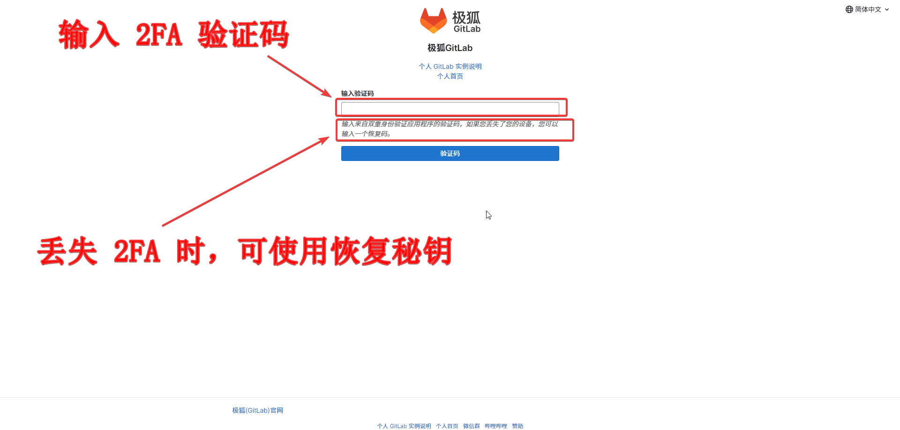

# 2FA 双因子验证/双因素验证 {id=2FA}

[[toc]]

## 介绍 {id=intro}

### 别名 {id=alias}

1. 2FA
2. 2 Factor Authentication
3. Two Factor Authentication
4. 双因子验证
5. 双因素验证

### 说明 {id=explain}

1. `2FA` 是一种安全密码验证方式。
2. 区别于传统的密码验证，由于传统的密码验证是由一组静态信息组成，如：字符、图像、手势等，很容易被获取，相对不安全。
3. `2FA` 是基于时间、历史长度、实物（信用卡、SMS手机、令牌、指纹）等自然变量结合一定的加密算法组合出一组动态密码，一般每 `60秒` 刷新一次。
4. 不容易被获取和破解，相对安全。

## 配置与使用 {id=config-use}

- 本文以 GitLab 为例（注意：GitLab 默认未强制开启 2FA，演示的 GitLab 强制开启了 2FA 验证）
- 本文以 `阿里云` APP 为例，其他支持的 2FA 雷同，如：微软 `Microsoft Authenticator` 等

### 配置 {id=config}

1. 进入 2FA 配置页面，点击配置 2FA，可以看到生成了一个 `二维码` 和 `Key`，两者效果相同，二维码扫描更方便

   

2. 手机安装 `阿里云` APP

   

3. 打开 `阿里云` APP，按照图中所示点击 2FA，不同版本的 `阿里云` APP 中 2FA 位置可能不同，请自行查找

   {width=300 height=200}

4. 点击 `扫码添加`，扫描上述 `二维码`

   

5. 扫码结果，点击确定

   

6. 添加成功后，会提示备份，此备份是 `阿里云` APP 的 2FA 数据备份，可用于恢复，与下方的恢复代码不同

   

7. 以后随时可以在右上角备份阿里云 APP 的 2FA

   

8. 填写 `用户密码`、`2FA 验证码`，即可完成 `2FA` 的配置

   

9. 根据图示备份 `GitLab` 平台的 `恢复秘钥`：当 `2FA` 丢失时使用

   

10. `GitLab` 配置完成的效果

   

### 使用 {id=use}

重新登录账户，会提示输入 2FA 的验证码

