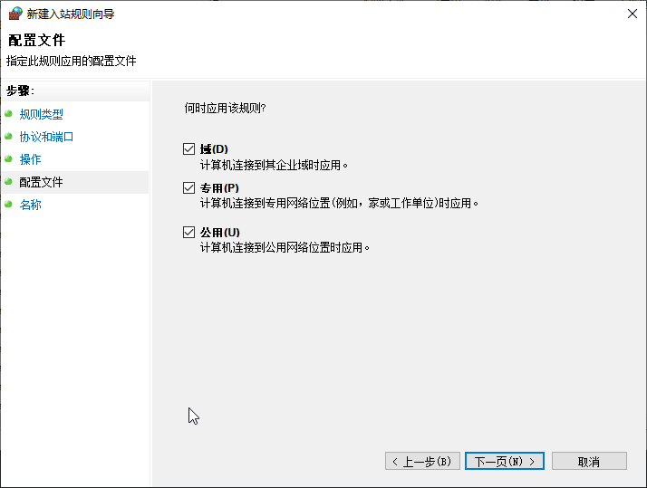

# Windows 配置网络 {id=netsh}

[[toc]]

## 文档 {id=doc}

1. [Netsh interface portproxy 命令](https://learn.microsoft.com/zh-cn/windows-server/networking/technologies/netsh/netsh-interface-portproxy)

## 端口代理/转发 {id=portproxy}

| 参数          | 说明           |
|-------------|--------------|
| `portproxy` | 端口代理/转发      |
| `add`       | 添加           |
| `delete`    | 删除           |
| `v4tov4`    | IPv4 转到 IPv4 |

1. <font color="red">添加、删除 命令需要管理员身份运行 cmd</font>
2. 查看已存在的端口代理/转发，无需管理员身份运行 cmd

::: code-group

```shell [添加端口代理/转发]
netsh interface portproxy add v4tov4 listenport=监听的端口 connectaddress=转发到的地址 connectport=转发到的端口
```

```shell [删除端口代理/转发]
netsh interface portproxy delete v4tov4 listenport=监听的端口
```

```shell [查看所有端口代理/转发]
netsh interface portproxy show all
```

:::

### 作者使用端口代理/转发场景 {id=situation}

1. 在使用 某些代理（`VPN`） 时，可能限制只能在一台电脑上登录、可能限制只能在 Windows 平台上使用。
   如果想在多设备上同时使用，无法直接连接软件的端口：

    1. 有些软件仅监听 `127.0.0.1`/`localhost`，不会监听本机网卡的 IP，所以导致同一个局域网的软件无法连接

    2. 如果软件安装在 Windows 上，这时可以使用端口代理/转发。比如：作者使用的 代理（`VPN`） 的端口是 `12333`，
       在当前电脑上将 `13333` 转发到本机 `127.0.0.1` 的 `12333`，Windows 防火墙开放 `13333` 端口
       （可临时关闭 Windows 防火墙做测试，但不推荐长时间关闭），
       这样在同一个局域网的设备都可以配置当前 Windows 的 IP 和 `13333` 端口 作为 代理（`VPN`） 使用了

   ::: code-group

   ```shell [添加端口代理/转发]
   Microsoft Windows [版本 10.0.19045.4780]
   (c) Microsoft Corporation。保留所有权利。
   
   C:\Windows\system32>netsh interface portproxy add v4tov4 listenport=13333 connectaddress=127.0.0.1 connectport=12333
   
   
   C:\Windows\system32>
   ```

   ```shell [查看所有端口代理/转发]
   Microsoft Windows [版本 10.0.19045.4780]
   (c) Microsoft Corporation。保留所有权利。
   
   C:\Users\xuxiaowei>netsh interface portproxy show all
   
   侦听 ipv4:                 连接到 ipv4:
   
   地址            端口        地址            端口
   --------------- ----------  --------------- ----------
   *               13333       127.0.0.1       12333
   
   
   C:\Users\xuxiaowei>
   ```

   ```shell [删除端口代理/转发]
   Microsoft Windows [版本 10.0.19045.4780]
   (c) Microsoft Corporation。保留所有权利。
   
   C:\Windows\system32>netsh interface portproxy delete v4tov4 listenport=13333
   
   
   C:\Windows\system32>
   ```

   :::

2. 在 Windows 开启 代理软件（`VPN`）后，可在配置中查看到代理使用的端口
   

### 配置 Windows 防火墙放行端口 {id=windows-defender-firewall}

- 以 Windows 10 为例，其他 Windows 类似

1. 在 Windows 上搜索 `防火墙`，选择 `高级安全 Windows Defender 防火墙`
   

2. 选择 `入站规则`，点击 `新建规则`
   

3. 选择 `端口`，点击 `下一页`
   

4. 输入 `端口`，点击 `下一页`
   

5. 点击 `下一页`
   

6. 点击 `下一页`
   

7. 输入 `名称`，建议使用端口名作为名称，推荐填写描述，点击 `完成` 即可
   
