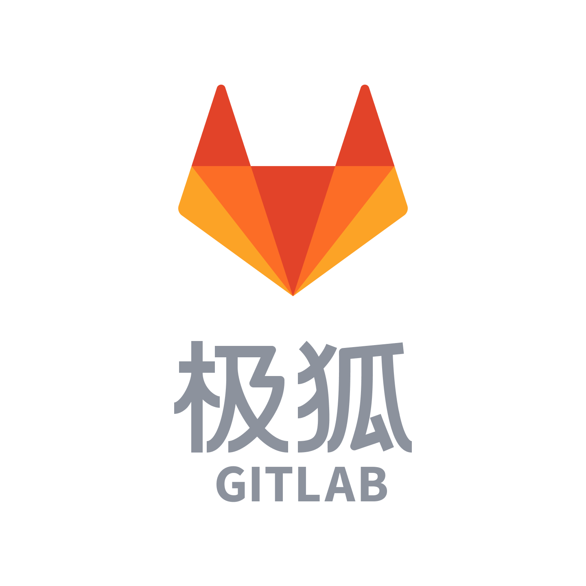

# 个人项目

[[toc]]

## 说明

- 按照字母顺序排序
- 仅列举部分项目
- 由于某种因素的限制与局限性，下表中的 `CI/CD` 可能存在多个值（曾在多个平台执行过流水线）
- 可能存在 Gitee、GitHub、CI/CD 仓库代码不一致的情况，正在开发工具用于统一管理各个仓库代码状态

| 码云 Gitee                                                                                             | GitHub                                                                                 | CI/CD                                                                                                                                                                                                                                                                                                                  | 说明                                                                                                                                                                                                                                                                                                                                                                                                                                                                                                                                |
|------------------------------------------------------------------------------------------------------|----------------------------------------------------------------------------------------|------------------------------------------------------------------------------------------------------------------------------------------------------------------------------------------------------------------------------------------------------------------------------------------------------------------------|-----------------------------------------------------------------------------------------------------------------------------------------------------------------------------------------------------------------------------------------------------------------------------------------------------------------------------------------------------------------------------------------------------------------------------------------------------------------------------------------------------------------------------------|
| [xuxiaowei-cloud/spring-cloud-xuxiaowei](https://gitee.com/xuxiaowei-cloud/spring-cloud-xuxiaowei)   |   | 
/
                                                                      | 重构微服务，支持最新版 Spring Cloud、Nacos、Consul、OAuth 2.1 协议                                                                                                                                                                                                                                                                                                                                                                                                                                                                                |
| [xuxiaowei-com-cn/cicd-release](https://gitee.com/xuxiaowei-com-cn/cicd-release)                     |            |                                                                                                                                                                                                                                    | 发布到 Gitee、GitHub、GitLab（支持自建 GitLab）、GitLink                                                                                                                                                                                                                                                                                                                                                                                                                                                                                      |
| [xuxiaowei-com-cn/consul-go](https://gitee.com/xuxiaowei-com-cn/consul-go)                           |               | 
/
                                                                                              | consul 脚手架：一键导出、导入 consul 的 Key/Value                                                                                                                                                                                                                                                                                                                                                                                                                                                                                             | 
| [xuxiaowei-com-cn/ct-oos-go](https://gitee.com/xuxiaowei-com-cn/ct-oos-go)                           |               |                                                                                                                                                                                                                                       | 天翼云 对象存储（经典版）I 型 脚手架                                                                                                                                                                                                                                                                                                                                                                                                                                                                                                              |
| [xuxiaowei-com-cn/ct-oos-go-sdk](https://gitee.com/xuxiaowei-com-cn/ct-oos-go-sdk)                   |           |                                                                                                                                                                                                                                                                                                                        | 天翼云 对象存储（经典版）I 型 Go SDK                                                                                                                                                                                                                                                                                                                                                                                                                                                                                                           |
| [xuxiaowei-com-cn/docker-in-docker](https://gitee.com/xuxiaowei-com-cn/docker-in-docker)             |        |                                                                                                                                                                                                                                      | 基于 GitLab Runner Docker-in-Docker 的示例：10 个分支                                                                                                                                                                                                                                                                                                                                                                                                                                                                                      | 
| [xuxiaowei-com-cn/gateway-shield](https://gitee.com/xuxiaowei-com-cn/gateway-shield)                 |          | 
/
                                                                                    | 基于 Spring Cloud Gateway 的项目，与 Nginx 类似，作者用于代理所有个人项目                                                                                                                                                                                                                                                                                                                                                                                                                                                                               |
| [xuxiaowei-com-cn/gitlab.rb](https://gitee.com/xuxiaowei-com-cn/gitlab.rb)                           |                                                                                        |                                                                                                                                                                                                                                                                                                                        | GitLab 相关配置                                                                                                                                                                                                                                                                                                                                                                                                                                                                                                                       |
| [xuxiaowei-com-cn/GitLab](https://gitee.com/xuxiaowei-com-cn/GitLab)                                 |                                                                                        |                                                                                                                                                                                                                                                                                                                        | GitLab 相关配置                                                                                                                                                                                                                                                                                                                                                                                                                                                                                                                       |
| [xuxiaowei-com-cn/gitlab-build-docker](https://gitee.com/xuxiaowei-com-cn/gitlab-build-docker)       |                                                                                        |                                                                                                                                                                                                        | 基于 GitLab Runner 制作 Docker 镜像：提供 5 中方案                                                                                                                                                                                                                                                                                                                                                                                                                                                                                            |
| [xuxiaowei-com-cn/gitlab-go](https://gitee.com/xuxiaowei-com-cn/gitlab-go)                           |               |                                                                                                                                                                                                                                       | GitLab 脚手架                                                                                                                                                                                                                                                                                                                                                                                                                                                                                                                        |
| [xuxiaowei-com-cn/gitlab-k8s](https://gitee.com/xuxiaowei-com-cn/gitlab-k8s)                         |              | 
//
 | GitLab、kubernetes（k8s）知识库                                                                                                                                                                                                                                                                                                                                                                                                                                                                                                         |
| [xuxiaowei-com-cn/gitlab-runner-helper](https://gitee.com/xuxiaowei-com-cn/gitlab-runner-helper)     |    |                                                                                                                                                                                                                        | 将 `registry.gitlab.com/gitlab-org/gitlab-runner/gitlab-runner-helper` 镜像同步到 [xuxiaoweicomcn/gitlab-runner-helper](https://hub.docker.com/r/xuxiaoweicomcn/gitlab-runner-helper)                                                                                                                                                                                                                                                                                                                                                   |
| [xuxiaowei-com-cn/go-gitlink](https://gitee.com/xuxiaowei-com-cn/go-gitlink)                         |              |                                                                                                                                                                                                                                                                                                                        | GitLink SDK                                                                                                                                                                                                                                                                                                                                                                                                                                                                                                                       |
| [xuxiaowei-com-cn/ingress-nginx](https://gitee.com/xuxiaowei-com-cn/ingress-nginx)                   |           |                                                                                                                                                                                                                               | 将 `registry.k8s.io/ingress-nginx/controller-chroot`、`registry.k8s.io/ingress-nginx/controller`、`registry.k8s.io/ingress-nginx/kube-webhook-certgen` 镜像分别同步到 [xuxiaoweicomcn/ingress-nginx-controller-chroot](https://hub.docker.com/r/xuxiaoweicomcn/ingress-nginx-controller-chroot)、[xuxiaoweicomcn/ingress-nginx-controller](https://hub.docker.com/r/xuxiaoweicomcn/ingress-nginx-controller)、[xuxiaoweicomcn/ingress-nginx-kube-webhook-certgen](https://hub.docker.com/r/xuxiaoweicomcn/ingress-nginx-kube-webhook-certgen) | 
| [xuxiaowei-com-cn/java](https://gitee.com/xuxiaowei-com-cn/java)                                     |                    |                                                                                                                                                                                                                                                                                                                        | 用于测试，如：请求头、Docker、Kubernetes 等                                                                                                                                                                                                                                                                                                                                                                                                                                                                                                    |
| [xuxiaowei-com-cn/jenkins](https://gitee.com/xuxiaowei-com-cn/jenkins)                               |                 |                                                                                                                                                                                                                                     | Jenkins 镜像增加 Docker 客户端                                                                                                                                                                                                                                                                                                                                                                                                                                                                                                           | 
| [xuxiaowei-com-cn/k8s.sh](https://gitee.com/xuxiaowei-com-cn/k8s.sh)                                 |                  |                                                                                                                                                                                                                     | Kubernetes（k8s）一键安装配置脚本，支持高可用                                                                                                                                                                                                                                                                                                                                                                                                                                                                                                     |
| [xuxiaowei-com-cn/kaniko](https://gitee.com/xuxiaowei-com-cn/kaniko)                                 |                  |                                                                                                                                                                                                                                      | 将 `gcr.io/kaniko-project/executor` 镜像同步到 [xuxiaoweicomcn/kaniko-project-executor](https://hub.docker.com/r/xuxiaoweicomcn/kaniko-project-executor)                                                                                                                                                                                                                                                                                                                                                                                | 
| [xuxiaowei-com-cn/kubernetes-website](https://gitee.com/xuxiaowei-com-cn/kubernetes-website)         |      | 
/
                                                                        | Kubernetes 文档构建构建成 docker 镜像并发布到国内网站：https://kubernetes.xuxiaowei.com.cn/zh-cn/                                                                                                                                                                                                                                                                                                                                                                                                                                                   |
| [xuxiaowei-com-cn/kube-state-metrics](https://gitee.com/xuxiaowei-com-cn/kube-state-metrics)         |      |                                                                                                                                                                                                                          | 将 `registry.k8s.io/kube-state-metrics/kube-state-metrics` 镜像同步到 [xuxiaoweicomcn/kube-state-metrics](https://hub.docker.com/r/xuxiaoweicomcn/kube-state-metrics)                                                                                                                                                                                                                                                                                                                                                                   |
| [xuxiaowei-com-cn/manage-maven](https://gitee.com/xuxiaowei-com-cn/manage-maven)                     |            |                                                                                                                                                                                                                                                                                                                        | 基于 Python 的 Maven 仓库管理，已停止更新，新版使用 Go 语言编写：[xuxiaowei-com-cn/nexus-go](https://github.com/xuxiaowei-com-cn/nexus-go)                                                                                                                                                                                                                                                                                                                                                                                                               |
| [xuxiaowei-com-cn/maven-dependencies](https://gitee.com/xuxiaowei-com-cn/maven-dependencies)         |      | 
/
                                                                                         | 分析、修改 Maven 依赖，可辅助 [xuxiaowei-io/nacos](https://gitee.com/xuxiaowei-io/nacos) 的流水线运行                                                                                                                                                                                                                                                                                                                                                                                                                                              |
| [xuxiaowei-com-cn/maven-mysql-client](https://gitee.com/xuxiaowei-com-cn/maven-mysql-client)         |      |                                                                                                                                                                                                                          | Maven 镜像增加 MySQL 客户端                                                                                                                                                                                                                                                                                                                                                                                                                                                                                                              |
| [xuxiaowei-com-cn/metrics-server](https://gitee.com/xuxiaowei-com-cn/metrics-server)                 |          |                                                                                                                                                                                                                              | 将 `registry.k8s.io/metrics-server/metrics-server` 镜像同步到 [xuxiaoweicomcn/metrics-server](https://hub.docker.com/r/xuxiaoweicomcn/metrics-server)                                                                                                                                                                                                                                                                                                                                                                                   |
| [xuxiaowei-com-cn/mvnd](https://gitee.com/xuxiaowei-com-cn/mvnd)                                     |                    |                                                                                                                                                                                                                                        | 基于 [apache/maven-mvnd](https://github.com/apache/maven-mvnd/) 制作的镜像                                                                                                                                                                                                                                                                                                                                                                                                                                                               |
| [xuxiaowei-com-cn/nexus-go](https://gitee.com/xuxiaowei-com-cn/nexus-go)                             |                |                                                                                                                                                                                                                                        | Nexus 管理工具                                                                                                                                                                                                                                                                                                                                                                                                                                                                                                                        |
| [xuxiaowei-com-cn/oauth2.1](https://gitee.com/xuxiaowei-com-cn/oauth2.1)                             |                                                                                        |                                                                                                                                                                                                                                                                                                                        | OAuth 2.1 示例项目（20 个分支）                                                                                                                                                                                                                                                                                                                                                                                                                                                                                                            |
| [xuxiaowei-com-cn/prometheus-adapter](https://gitee.com/xuxiaowei-com-cn/prometheus-adapter)         |      |                                                                                                                                                                                                                          | 将 `registry.k8s.io/prometheus-adapter/prometheus-adapter` 镜像同步到 [xuxiaoweicomcn/prometheus-adapter](https://hub.docker.com/r/xuxiaoweicomcn/prometheus-adapter)                                                                                                                                                                                                                                                                                                                                                                   |
| [xuxiaowei-com-cn/spring-boot-oauth2-jwt](https://gitee.com/xuxiaowei-com-cn/spring-boot-oauth2-jwt) |  |                                                                                                                                                                                                                                                                                                                        | OAuth 2.0 示例项目（17 个分支）                                                                                                                                                                                                                                                                                                                                                                                                                                                                                                            |
| [xuxiaowei-io/nacos](https://gitee.com/xuxiaowei-io/nacos)                                           |                       |                                                                                                                                                                                                                                       | 处理 Nacos 官方没有发布的依赖，发布坐标：[io.xuxiaowei.nacos](https://mvnrepository.com/artifact/io.xuxiaowei.nacos)                                                                                                                                                                                                                                                                                                                                                                                                                               |
| [xuxiaowei-io/nacos-console-ui](https://gitee.com/xuxiaowei-io/nacos-console-ui)                     |            |                                                                                                                                                                                                                            | 处理 Nacos 官方没有发布的依赖，发布坐标：[io.xuxiaowei.nacos](https://mvnrepository.com/artifact/io.xuxiaowei.nacos)                                                                                                                                                                                                                                                                                                                                                                                                                               |

